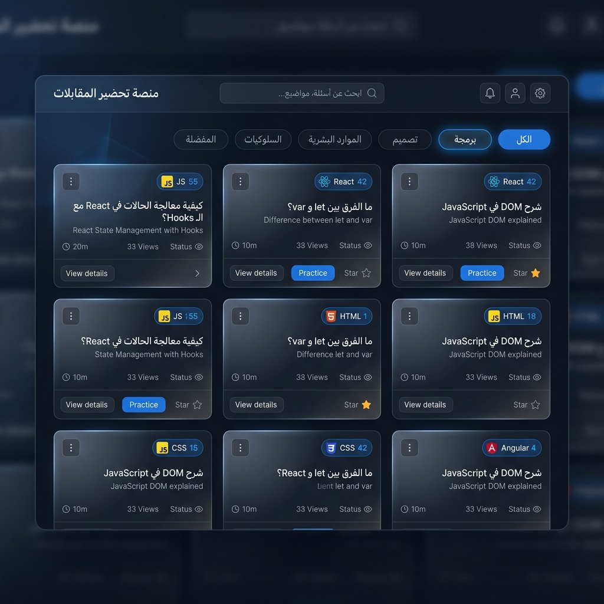

<p align="center">
  
</p>

<h1 align="center">🎯 Front-End Interview Prep</h1>

<p align="center">
  <strong>منصة مجتمعية للمطورين العرب للتحضير لمقابلات الـ Front-End</strong>
  <br/>
  <em>388+ سؤال مع إجابات تفصيلية بالعربية — مجمّعة من 32 فيديو حقيقي لمقابلات</em>
</p>

<p align="center">
  
  
  
  
  
</p>

---

## 📖 عن المشروع

**Front-End Interview Prep** هي منصة مفتوحة المصدر تساعد المطورين العرب على التحضير لمقابلات الـ Front-End. تم تجميع الأسئلة من 32 فيديو حقيقي لمقابلات عمل، وتصنيفها حسب الموضوع والصعوبة، مع إجابات مفصّلة وأمثلة أكواد.

### لماذا هذا المشروع؟

- 🇸🇦 **بالعربية** — إجابات مفصّلة بالعربية مع النص الإنجليزي الأصلي
- 📊 **مرتب حسب التكرار** — الأسئلة الأكثر تكرارًا في المقابلات تظهر أولاً
- 🤖 **AI مساعد** — اسأل أي سؤال واحصل على إجابة فورية بالعربية
- 👥 **مجتمع تفاعلي** — اقترح أسئلة، ناقش، وصوّت على أفضل الإجابات

---

## ✨ المميزات

| الميزة | الوصف |
|--------|-------|
| 📚 **مكتبة الأسئلة** | 388+ سؤال مصنّف حسب JavaScript, ReactJS, HTML, CSS, الشبكات |
| 🔍 **بحث ذكي** | بحث بالعربي والإنجليزي مع فلترة بالموضوع والصعوبة |
| 🤖 **اسأل AI** | تكامل مع Gemini 1.5 Flash للإجابة على أي سؤال فورياً |
| 💬 **التعليقات** | نظام تعليقات متداخل على كل سؤال |
| ❤️ **الإعجابات** | سجّل إعجابك بالأسئلة والتعليقات المفيدة |
| ⭐ **المفضلة** | احفظ الأسئلة المهمة في ملفك الشخصي |
| 💡 **المجتمع** | اقترح أسئلة جديدة وناقشها مع المجتمع |
| 🔐 **تسجيل الدخول** | Google أو GitHub عبر OAuth |
| 👑 **لوحة الإدارة** | إدارة المحتوى والمستخدمين للأدمن |
| 🌙 **وضع مظلم/فاتح** | تبديل سلس مع حفظ التفضيل |
| 📱 **متجاوب** | يعمل على الموبايل والديسكتوب مع دعم RTL |

---

## 🛠️ التقنيات المستخدمة

```
Frontend:    Next.js 16  ·  React 19  ·  TypeScript 5
Styling:     Tailwind CSS v4  ·  CSS Custom Utilities
Backend:     PocketBase (SQLite)  ·  REST API
Auth:        OAuth2 (Google + GitHub)
AI:          Google Gemini 1.5 Flash
Deployment:  Vercel (frontend)  ·  VPS/Railway (backend)
```

---

## 📁 هيكل المشروع

```
├── app/                     ← صفحات التطبيق (App Router)
│   ├── page.tsx             ← الصفحة الرئيسية (مكتبة الأسئلة)
│   ├── ask/                 ← صفحة اسأل AI
│   ├── suggest/             ← صفحة المجتمع
│   ├── questions/[id]/      ← تفاصيل السؤال + التعليقات
│   ├── profile/             ← الملف الشخصي
│   ├── admin/               ← لوحة الإدارة
│   └── api/seed/            ← API لإدخال الأسئلة
│
├── components/              ← المكوّنات
│   ├── QuestionCard.tsx     ← بطاقة السؤال مع الأكورديون
│   ├── CommentSection.tsx   ← نظام التعليقات المتداخل
│   ├── Navbar.tsx           ← شريط التنقل + نافذة تسجيل الدخول
│   └── ui.tsx               ← مكوّنات واجهة مشتركة
│
├── context/                 ← AuthContext (Google/GitHub OAuth)
├── data/                    ← بيانات الأسئلة (questions.ts)
├── lib/                     ← PocketBase client + Gemini API
├── scripts/                 ← أدوات مساعدة (make_admin)
└── types/                   ← TypeScript interfaces
```

---

## 🚀 التشغيل المحلي

### المتطلبات

- [Node.js](https://nodejs.org/) v18+
- [PocketBase](https://pocketbase.io/docs/) (أو Supabase)

### الخطوات

```bash
# 1. استنساخ المشروع
git clone https://github.com/Mohammedaliyassen/interviews_prep.git
cd interviews_prep

# 2. تثبيت الحزم
npm install

# 3. إعداد ملف البيئة
cp .env.example .env.local
# عدّل .env.local بالقيم الخاصة بك

# 4. تشغيل التطبيق
npm run dev
```

افتح **http://localhost:3000** 🎉

### إعداد قاعدة البيانات

<details>
<summary>📦 باستخدام PocketBase (محلياً)</summary>

```bash
# 1. حمّل PocketBase من https://pocketbase.io/docs/
# 2. شغّله
./pocketbase serve

# 3. أنشئ حساب أدمن على http://127.0.0.1:8090/_/
# 4. عدّل .env.local:
#    NEXT_PUBLIC_POCKETBASE_URL=http://127.0.0.1:8090

# 5. أدخل الأسئلة
curl -X POST http://localhost:3000/api/seed -H "x-admin-secret: change-me-to-any-secret"
```

</details>

<details>
<summary>☁️ باستخدام Supabase (سحابي مجاني)</summary>

```bash
# 1. أنشئ مشروع على https://supabase.com
# 2. شغّل ملف supabase/schema.sql في SQL Editor
# 3. عدّل .env.local:
#    NEXT_PUBLIC_SUPABASE_URL=https://xxxxx.supabase.co
#    NEXT_PUBLIC_SUPABASE_PUBLISHABLE_KEY=your-key
# 4. أدخل الأسئلة:
#    node supabase/seed_questions.mjs <URL> <SERVICE_KEY>
```

</details>

---

## 🌐 النشر (Deploy)

### Frontend → Vercel (مجاني)

1. ارفع المشروع على GitHub
2. اذهب إلى [vercel.com](https://vercel.com) → New Project → Import
3. أضف متغيرات البيئة:
   - `NEXT_PUBLIC_POCKETBASE_URL` أو `NEXT_PUBLIC_SUPABASE_URL`
4. اضغط **Deploy** 🚀

### Backend → Supabase (مجاني)

Supabase يوفر خطة مجانية تشمل قاعدة بيانات PostgreSQL + Auth + REST API.

---

## 👑 صلاحيات الأدمن

بعد تسجيل الدخول بـ OAuth:

```bash
# PocketBase: في لوحة التحكم → users → غيّر role إلى admin
# Supabase: في SQL Editor شغّل:
SELECT public.make_admin('your-email@gmail.com');
```

---

## 🔑 متغيرات البيئة

| المتغير | مطلوب | الوصف |
|---------|:-----:|-------|
| `NEXT_PUBLIC_POCKETBASE_URL` | ✅* | رابط خادم PocketBase |
| `NEXT_PUBLIC_SUPABASE_URL` | ✅* | رابط مشروع Supabase |
| `NEXT_PUBLIC_SUPABASE_PUBLISHABLE_KEY` | ✅* | مفتاح Supabase العام |
| `SEED_ADMIN_SECRET` | Seed | سر لـ API إدخال الأسئلة |
| `NEXT_PUBLIC_GEMINI_API_KEY` | اختياري | مفتاح Gemini لصفحة اسأل AI |

> \* استخدم إما PocketBase أو Supabase

---

## 🤝 المساهمة

المساهمات مرحّب بها! افتح Issue أو Pull Request.

---

## 📜 الرخصة

هذا المشروع مفتوح المصدر تحت رخصة [MIT](LICENSE).

---

<p align="center">
  صُنع بـ ❤️ للمطورين العرب
</p>
